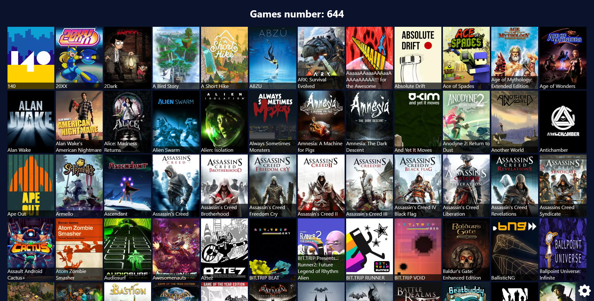

# Playnite Web

## Why?

You're in love with your Playnite library on your desktop. You're not at home and you want to check if you already bought a game that a friend is talking about. With Playnite Web, you can!

## Screenshot

## Dependencies

- PHP 7
- webp package (JPG version as fallback is planed)

## Setup

- Clone this repository
- Move your Playnite library into the `data` folder

## How can I move my Playnite library to your `data` folder?

- Go to `Settings` > `Advanced`
- Open your files explorer at the `Database location` path
- Close Playnite
- Move the `library` folder into the Playnite Web `data` folder
- Restart Playnite
- Go to `Settings` > `Advanced`
- Update the `Database location` path with the new location
- Restart Playnite

## TODO

- Alphabetical view with anchors
- use GD to generate JPG instead of WebP as a fallback
- Offline support
